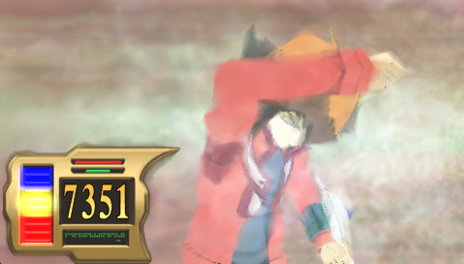
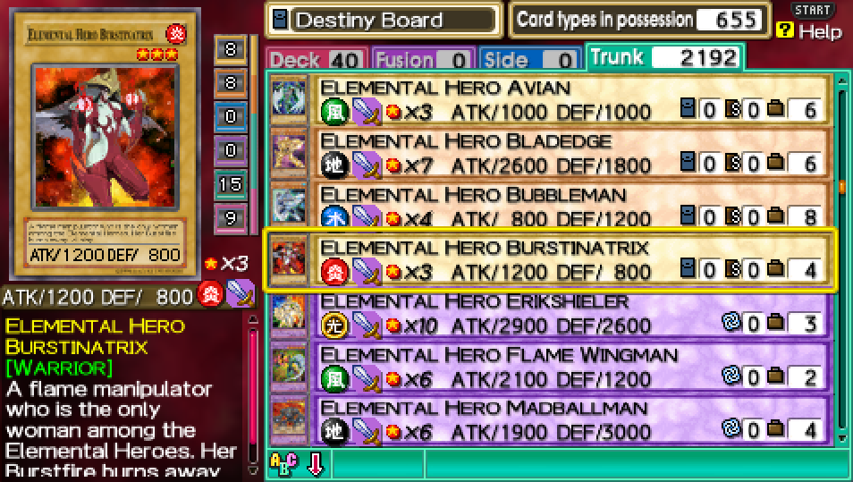

# tagforce-essentials
A collection of mods made by myself for Yu-Gi-Oh! GX Tag Force PSP.  
**Both European (ULES-00600) and American (ULUS-10136) versions of the game are supported.  
All in-game selectable languages are supported.**

## Included Mods [UMD Compatible]
- Japanese Voice Enabler
  - Allows the game to play the Japanese voices included in the files on the Title Screen, in the Card Shop and during normal Gameplay.

- Japanese Point Gauge Display
  - Allows the game to use the Point Gauge from the Japanese version of the game for the ATK/DEF display of a monster, and Life Points displayed in the 3D cutscenes in duels.

	 -> 

 

	 -> 

 

- Uncensored Cards
  - Allows the game to display the Japanese Artwork of cards, Uncensored FMVs for special monster animations and other card related effects whilst keeping the game's currently selected language.

	 -> 

 

	 -> 

 

	 -> 

 

	 -> 

 
	
# Installation (Real Hardware)
The following installation guide assumes you have already set up your PSP with Custom Firmware and your choice of a cheat engine (TempAR/CWCheat). 

1. Drag and Drop the ISO backup of the game onto `tagforce-essentials.exe`.
   - (Alternatively run the exe in command line as the following: `tagforce-essentials.exe <path_to_iso>`)
2. Connect your PSP with USB to copy files to Memory Stick.
3. Copy the generated `PSP` folder and its contents to the Memory Stick's root.
4. Install the Codes from the `Codes\PSP` folder for your region of the game to TempAR or CWCheat.
5. Turn on the installed cheats in TempAR or CWCheat.
6. Unplug the PSP and boot up the game and enable the cheats inside TempAR/CWCheat).
7. If you've done everything correctly after turning the cheats on in TempAR or CWCheat the mods should now work (certain areas may need to be reloaded if you enable the codes while in them, for example: if the codes are enabled in the Shop the Shop area might need to be reloaded for the codes to work).

# Installation (Emulator)
1. Download the latest version of [PPSSPP](https://www.ppsspp.org/).
2. Drag and Drop the ISO backup of the game onto `tagforce-essentials.exe`.
   - (Alternatively run the exe in command line as the following: `tagforce-essentials.exe <path_to_iso>`)
3. Copy the generated `PSP` folder and its contents to `<ppsspp_root>\memstick\`.
4. Copy the Codes from the `Codes\PPSSPP` folder for your region of the game to `<ppsspp_root>\memstick\PSP\Cheats\`.
5. Turn on the installed cheats for the game inside PPSSPP for the game.
6. If you've done everything correctly after turning the cheats on  in PPSSPP the mods should now work (certain areas may need to be reloaded if you enable the codes while in them, for example: if the codes are enabled in the Shop the Shop area might need to be reloaded for the codes to work).

# Known Issues
- TempAR will fail to boot the game on real hardware if the patches are enabled at boot. There are two ways to get around this:
  - Bringing up TempAR's menu before the game can boot and waiting for the game to check the memory card data to exit out of its menu.
  - Enabling the cheats only once the game has finished booting up and not saving them to auto-enable on boot.
- CWCheat will fail to apply the cheats fast enough for the game to be able to play the Title Screen voices on boot as the title screen code gets loaded very early on.
- CWCheat will hard crash the console if the Uncensored Cards cheat is used.

# Nuget Packages
- [XDeltaSharp](https://github.com/pleonex/xdelta-sharp) - Allowing the xdelta patches to be applied by code.
- [DiscUtils](https://github.com/DiscUtils/DiscUtils) - Allowing ISO files to be loaded and extracted in C#.

# Special Thanks
- [Matheus Abreu](https://gbatemp.net/members/matheus-abreu.400265/) - Creator of the original Japanese Voice Enabler xdelta patches that were used for researching how to enable the voices from the game's code directly.
